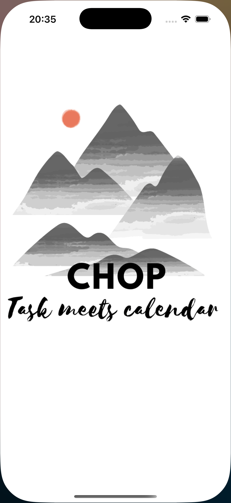
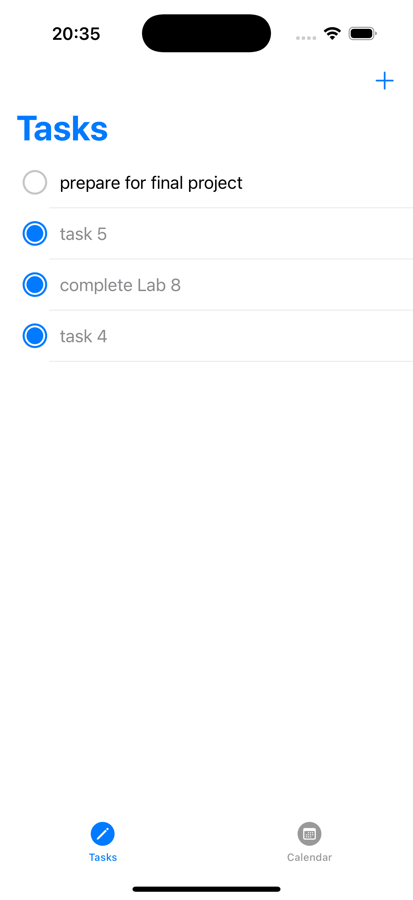
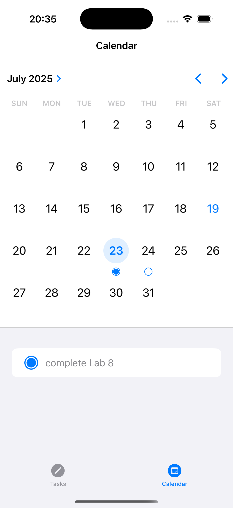

Chop

Submitted by: **Sneha Siri Nagabathula**

Chop is an app that brings to-do list and calendar - eliminating the need for two separate apps. It provides user a broader outlook where they can look at their productive 
life in the precision of day, week, months, or even a year.

Time spent: **3** hours spent in total

## Required Features

The following functionality is implemented:

- App displays a list of tasks
- Users can add tasks to the list
-  Session persists when application is closed and relaunched (tasks dont get deleted when closing app) 
-  asks can be deleted
-  Users have a calendar view via navigation controller that displays tasks	

The User can also : 
-  Tasks can be toggled completed
-  User can edit tasks by tapping on the task in the feed view
-  User can toggle tasks on  and off in both tabs - Task and Calendar
-  User can see the completed tasks in both tabs. Only the deleted tasks are not displayed

## App Screenshots

  
  
  

## Video Walkthrough

Loom link to project demo - https://www.loom.com/share/e48581d4ae6149a7a0e1a8072bbd6a4e?sid=3d0127ec-8080-49ab-94ab-9b085f130549 

## License

    Copyright [2025] [Sneha Siri Nagabathula]

    Licensed under the Apache License, Version 2.0 (the "License");
    you may not use this file except in compliance with the License.
    You may obtain a copy of the License at

        http://www.apache.org/licenses/LICENSE-2.0

    Unless required by applicable law or agreed to in writing, software
    distributed under the License is distributed on an "AS IS" BASIS,
    WITHOUT WARRANTIES OR CONDITIONS OF ANY KIND, either express or implied.
    See the License for the specific language governing permissions and
    limitations under the License.
